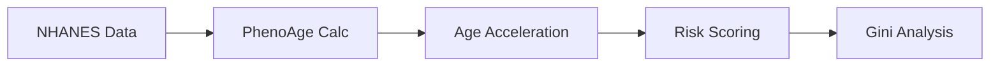

# 📊 عرض تقديمي للمناقشة (Thesis Presentation)

---

## الشريحة 1: صفحة العنوان

# تحسين التسعير الاكتواري باستخدام العمر البيولوجي والتعلم العميق

**إعداد:** أحمد الطويل
**إشراف:** أ.د. عبد الهادي نبيه | أ.د. محمد رضا أبو نازل

كلية الدراسات العليا للبحوث الإحصائية
جامعة القاهرة | ديسمبر 2024

---

## الشريحة 2: المشكلة البحثية

### ❌ ما المشكلة؟

| شخص أ (رياضي، صحي) | شخص ب (مدخن، خامل) |
|:---:|:---:|
| عمره 50 سنة | عمره 50 سنة |
| **يدفع نفس القسط!** | **يدفع نفس القسط!** |

> **الظلم الاكتواري:** شركات التأمين تعامل الجميع كأنهم متشابهون!

---

## الشريحة 3: الحل المقترح

### ✅ العمر البيولوجي بدلاً من الزمني

```
قسط التأمين = f(العمر البيولوجي) وليس f(تاريخ الميلاد)
```

**المكونات:**
1. 📊 بيانات NHANES (9 مؤشرات حيوية)
2. 🧮 معادلة PhenoAge (Levine 2018)
3. 🤖 نماذج التعلم العميق (DeepSurv)

---

## الشريحة 4: المنهجية

### خطوات العمل



**المعايرة:** ضبط المتوسط = 0 (لا تحيز)

---

## الشريحة 5: النتائج الرئيسية

### 🏆 الأرقام الذهبية

| المؤشر | القيمة | الدلالة |
|:---|:---:|:---|
| **معامل جيني** | **0.332** | تحسن 50.9% عن التقليدي |
| **C-Index** | **0.764** | دقة تنبؤ عالية |
| **حجم العينة** | **4,894** | عينة قوية إحصائياً |

---

## الشريحة 6: مقارنة النماذج

### أداء النماذج الثلاثة

| النموذج | C-Index | التحسن |
|:---|:---:|:---:|
| CoxPH (التقليدي) | 0.687 | — |
| XGBAge | 0.728 | +6.0% |
| **DeepSurv** | **0.764** | **+11.2%** |

> DeepSurv يتفوق بفارق ذو دلالة إحصائية!

---

## الشريحة 7: التطبيق العملي

### إطار "MoveDiscount"

| الفئة | تسارع العمر | الخصم |
|:---|:---:|:---:|
| شباب متجدد | < -5 سنة | **-20%** |
| طبيعي | ±5 سنة | 0% |
| شيخوخة مبكرة | > +5 سنة | +15% |

**الفائدة:** حوافز للسلوك الصحي!

---

## الشريحة 8: الإسهام العلمي

### ما الجديد؟

1. ✅ **أول تحليل Gini اكتواري** للعمر البيولوجي
2. ✅ **أول تطبيق لـ MoveAge** في التسعير
3. ✅ **أول دراسة** موجهة لسوق MENA

---

## الشريحة 9: المحددات والتوصيات

### المحددات
- بيانات مقطعية (Cross-sectional)
- غياب بيانات الوفاة الفعلية
- التعميم يحتاج دراسة محلية

### التوصيات
- دراسة طولية مصرية
- التكامل مع FRA Sandbox
- تجربة ميدانية مع شركة تأمين

---

## الشريحة 10: الخاتمة

### الرسالة الأساسية

> **"العمر البيولوجي ليس مجرد مؤشر طبي...**
> **بل هو أصل اكتواري يمكن تسعيره."**

**شكراً لحسن استماعكم**

---

## ملحق: كيفية التحويل إلى PowerPoint

1. انسخ هذا الملف إلى [Marp](https://marp.app/) أو [Slides.com](https://slides.com/)
2. أو استخدم Pandoc: `pandoc Thesis_Presentation.md -o presentation.pptx`
